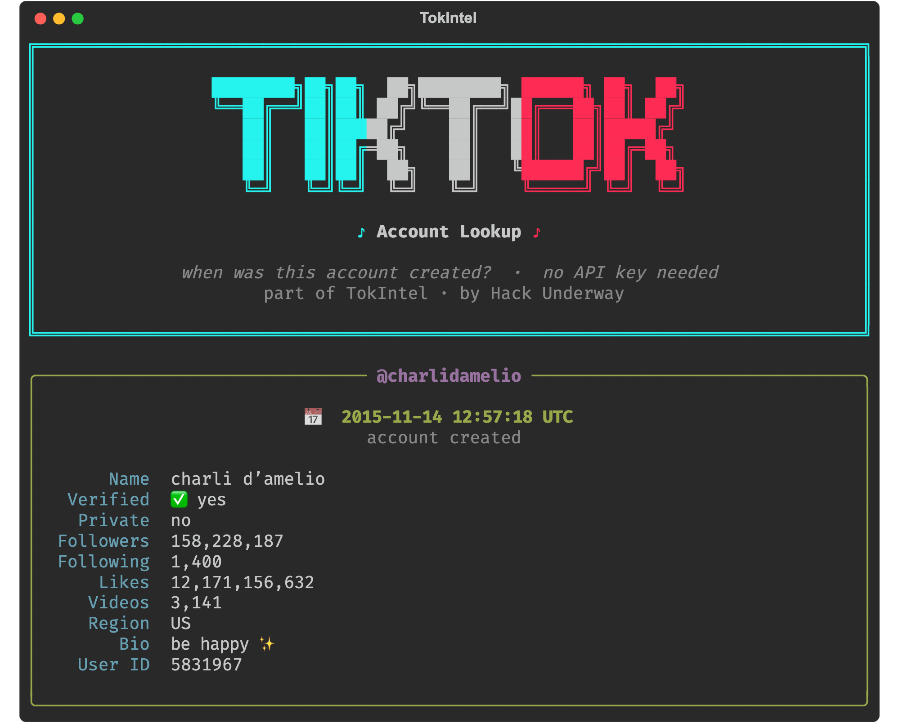

<h1 align="center">TokIntel: free TikTok account lookup</h1>

<p align="center">
  
</p>

<p align="center">
  
  
  
</p>

<p align="center">Find when a TikTok account was created. No API key, no signup, just a username.</p>

---

## ✨ What it does

- **Account creation date** from a username, `@handle`, or profile URL, plus followers, likes, bio, verified, and private status.
- **Video upload time** from a video URL or id (the snowflake timestamp, `id >> 32`).
- **Reports** saved to `reports/` as JSON and TXT.
- A clean terminal UI, or a single command. No RapidAPI, no key, no card.

## ⬇️ Get it

**Easiest, no tools needed:** click the green **`< > Code`** button near the top of this page, choose **Download ZIP**, then unzip it.

**Or with git:**
```bash
git clone https://github.com/Thyfwx/TokIntel.git
cd TokIntel
```

The only thing you need installed yourself is **Python 3.11 or newer** ([get it from python.org](https://www.python.org/downloads/) if you don't have it). Everything else (`requests`, `colorama`, `rich`) is installed for you automatically the first time you run it.

## 🚀 Run it

| Your system | How to start |
| --- | --- |
| **macOS** | double click `TokIntel.app` (or `TokIntel.command`) |
| **Windows** | double click `start.bat` |
| **Linux / any terminal** | run `./start.sh` |

The launcher builds its own virtual environment and installs `requests`, `colorama`, and `rich` on first run, so there is nothing to set up by hand.

> **macOS:** if you downloaded the ZIP and a double-click is blocked ("unidentified developer"), right-click `TokIntel.app` → **Open** → **Open** once, and it will trust it from then on. Cloning with git avoids this entirely.

Prefer the command line?

```bash
python3 tiktok_created.py charlidamelio
python3 tiktok_created.py @nasa https://www.tiktok.com/@zachking
```

## 🔍 How it works

TikTok embeds the account `createTime` in the JSON on every public profile page, so one request to the profile is enough to read it. Video IDs are snowflakes, so a video's upload time comes from `id >> 32`. No login, no third party API.

## 📦 Requirements

Python 3.11+ and `requests`, `colorama`, `rich` (installed automatically by the launcher, or `pip install -r requirements.txt`).

## 🙌 Credit

Built on top of [TokIntel](https://github.com/HackUnderway/TokIntel) by Victor Bancayan (Hack Underway). The original does more, including email and phone lookups through RapidAPI. This build is a free option that needs no key, for looking up creation dates. Licensed under MIT, see [LICENSE](LICENSE).

## ⚠️ Disclaimer

For educational and OSINT research only. It reads public profile data. Do not use it for anything illegal.
