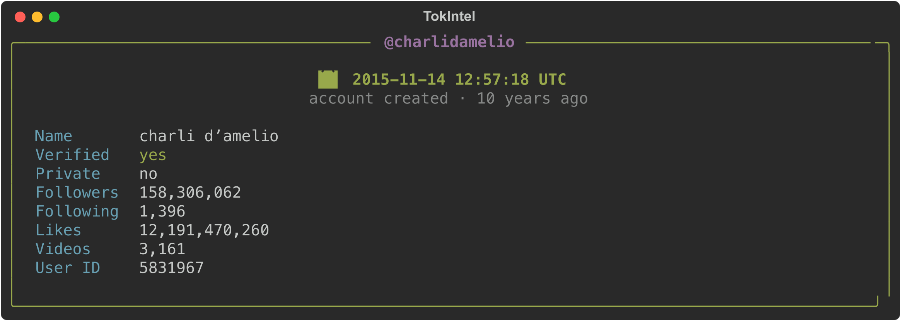
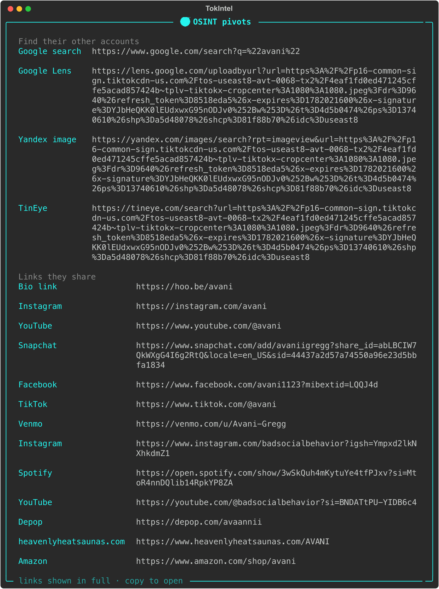
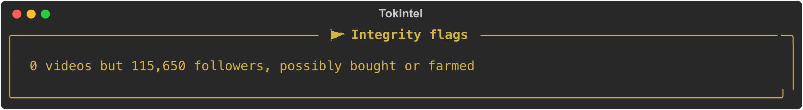
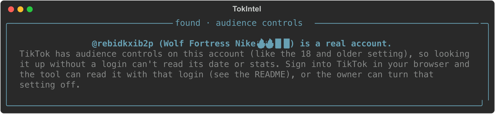

<h1 align="center">TokIntel: free TikTok account lookup</h1>

<p align="center">
  
</p>

<p align="center">
  
  
  
</p>

<p align="center">Look up any TikTok account: its creation date, its stats, and the real accounts behind the person.<br>No API key, no signup, just a username.</p>

---

## 🔎 What it does

- **Account creation date** from a username, `@handle`, or profile URL, plus followers, likes, bio, verified, and private status.
- **Video upload time** from a video URL or id (the snowflake timestamp, `id >> 32`).
- **Optional OSINT pivots** (opt in), in three honest layers:
  - **Links they share** (confirmed): the bio link, the whole list off their own Linktree (or hoo.be, Beacons, Carrd, a personal website), handles they spell out in their bio text, and any same-handle account whose page **links back to this TikTok**, which proves it's them, along with the accounts that page lists.
  - **Same username elsewhere** (unverified): the exact handle checked on the platforms that reliably tell a real account from a fake (GitHub, YouTube, Snapchat, SoundCloud, Patreon, Tumblr, Roblox, Linktree, Behance, Last.fm, Chess.com, Pastebin, Flickr), plus a keyless web search. Marked unverified, since a shared handle can belong to a different person, so check the photo. If nothing turns up, it says so.
  - **Verify it's really them**: a reverse image search of the avatar (Yandex, to find the same face online), a web search of the handle, and a Wayback snapshot when one exists.
- **Optional integrity flags** (opt in): heuristic signals for bought followers, follow farms, rapid growth, and recent handle or display name changes, shown as neutral context rather than accusations.
- **Reports** saved to `reports/` as JSON and TXT.
- A clean terminal UI, or a single command. No RapidAPI, no key, no card.

<details>
<summary><b>More screenshots</b></summary>

<br>

<p align="center"><i>A full account lookup</i><br></p>

<p align="center"><i>OSINT pivots: confirmed accounts in green, unverified same-username leads in yellow, and tools to verify the person</i><br></p>

<p align="center"><i>Integrity flags</i><br></p>

<p align="center"><i>An account with audience controls on</i><br></p>

</details>

## ⬇️ Get it

**Easiest, no tools needed:** click the green **`< > Code`** button near the top of this page, choose **Download ZIP**, then unzip it.

**Or with git:**
```bash
git clone https://github.com/Thyfwx/TokIntel.git
cd TokIntel
```

The only thing you need installed yourself is **Python 3.11 or newer** ([get it from python.org](https://www.python.org/downloads/) if you don't have it). Everything else (`requests`, `colorama`, `rich`) is installed for you automatically the first time you run it.

## 🚀 Run it

| Your system | How to start |
| --- | --- |
| **macOS** | double click `TokIntel.app` (or `TokIntel.command`) |
| **Windows** | double click `start.bat` |
| **Linux / any terminal** | run `./start.sh` |

The launcher builds its own virtual environment and installs `requests`, `colorama`, and `rich` on first run, so there is nothing to set up by hand.

> **macOS:** if you downloaded the ZIP and a double-click is blocked ("unidentified developer"), right-click `TokIntel.app` → **Open** → **Open** once, and it will trust it from then on. Cloning with git avoids this entirely.

Prefer the command line?

```bash
python3 tiktok_created.py charlidamelio
python3 tiktok_created.py @nasa https://www.tiktok.com/@zachking

# Optional extras (off by default)
python3 tiktok_created.py charlidamelio --osint    # add pivot links
python3 tiktok_created.py charlidamelio --flags    # add integrity heuristics
python3 tiktok_created.py charlidamelio --all      # both
```

In the interactive UI, a short numbered menu appears after each card so you can pull the extras up only when you want them.

## ⚙️ How it works

TikTok embeds the account `createTime` in the JSON on every public profile page, so one request to the profile is enough to read it. Video IDs are snowflakes, so a video's upload time comes from `id >> 32`. No login and no third party API for public accounts, which is almost all of them.

## 🔒 Accounts with audience controls on (optional)

A few accounts turn on TikTok's audience controls, for example the "18 and older" setting. TikTok then refuses to show that profile to anyone who is not signed in, so a normal lookup gets no date or stats back. That is the account owner's setting, not a limit of this tool, and most accounts have it off and need nothing.

You can still read these with your own TikTok login, and there is nothing to install or paste. Just look the account up in the app. When it is locked, it asks:

```
read it with  chrome / firefox / edge / brave / safari
```

Pick the browser you are already signed into TikTok on, and it reads the account with that login. If you are not signed in, it just tells you to sign in and try again, no errors and no dead ends.

Your privacy, plainly: the login is read only on your own computer, only for that one lookup. It is never saved, sent anywhere, shown, or written into the code, so a clone or a fork has nothing of yours in it.

Prefer the command line? Set `TIKTOK_COOKIES_FROM_BROWSER=chrome` (or `firefox`, `edge`, `brave`, `safari`) before running, or drop your `sessionid` value into a gitignored `tiktok_session.txt`.

## 📦 Requirements

Python 3.11+ and `requests`, `colorama`, `rich` (installed automatically by the launcher, or `pip install -r requirements.txt`).

## 🙌 Credit

Built on top of [TokIntel](https://github.com/HackUnderway/TokIntel) by Victor Bancayan (Hack Underway). The original does email and phone lookups through RapidAPI. This build goes a different way: no key at all, for looking up an account and finding the real person behind it. Licensed under MIT, see [LICENSE](LICENSE).

## ⚠️ Disclaimer

For educational and OSINT research only. It reads public profile data. Do not use it for anything illegal.
